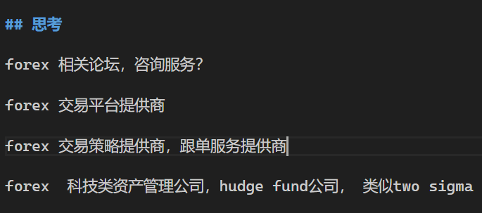

# Forgein Exchange

## 开户篇

开户介绍：
https://www.fxtop50.com/xm/
关注不同的账户类型

XM FX 官网：
https://www.xmcnbroker.direct/cn/platforms

ICMarksSC ： https://www.icibw.com/
IC Markets global:
https://www.icmarkets.com/global/cn/

## 他山之石

two sigma：从18年前进入量化投资领域，主要投资于公开市场产品，股票、商品、外汇等。如今，共管理600亿美元资产。它正试图进入私募投资领域，希望能够像18年前进入公开市场一样重塑私募投资市场。

https://m.caijing.com.cn/api/show?contentid=4602611

https://zhuang.blog.caixin.com/archives/243768
https://www.36kr.com/p/1722515963905

## 思考

forex 相关论坛，咨询服务？

forex 交易平台提供商

forex 交易策略提供商，跟单服务提供商

forex  科技类资产管理公司，hudge fund公司， 类似two sigma

渡边太太：

## 头脑风暴
产品需求： 
* 听懂人话，告诉他到达2319点位，帮我平仓掉所有的sell单。

## EA

视频:
- algolee ： 
[【新手向】2分钟生成一个RSI的自动交易程序](https://www.bilibili.com/video/BV1EJ4m187Pj/?spm_id_from=333.880.my_history.page.click)

- [mt5使用技巧](https://www.bilibili.com/video/BV1tr421c79W/?spm_id_from=333.1387.favlist.content.click&vd_source=ff1d5f0f1a1b50dc5fc0b20e64d1bba6)

- [deepseek写mt5量化交易](https://www.bilibili.com/video/BV1BtXRYoEZT/?spm_id_from=333.1387.upload.video_card.click&vd_source=ff1d5f0f1a1b50dc5fc0b20e64d1bba6)

书：
https://www.mql5.com/zh/book/intro

## 基础

需要怎样的基本知识，技术，心态，才能在黄金，外汇市场获取到稳定的盈利 ?

轻仓 ： 保住本金
时机，不频繁操作 ：像鳄鱼一样，静候，静候，静候，等待， 时机到了，也需要咬一口

**止损**：
不抗单，什么情况下进行止损？亏损是常态
买入时，分析好风控防线在哪里，有依据的止损，保护本金。

止盈： 留住自己成果

入场： 那什么时候才到了合适的入场时机呢？

关联因子： 
利息负相关
美元负相关   石油正相关  
非农经济数据
政治因素
国际局势

套利： ？理解：我国的利率3%， 美国的利率是5% ，我从本国银行借出钱，存到美国银行，就有2%的套利利差。但风险在哪里？利差变小或变负

阿尔法：

beta：

回撤：
头寸：

在金融和投资领域，"头寸"和"回撤"是两个重要概念，具体含义如下：

---

### **一、头寸（Position）**
**定义**：指投资者在某一金融资产（如股票、外汇、期货等）上的持仓情况，即持有的资产数量或金额。

**关键点**：
1. **多头头寸（Long Position）**：买入资产，预期价格上涨获利。
2. **空头头寸（Short Position）**：借入并卖出资产，预期价格下跌后低价买回获利。
3. **头寸管理**：投资者通过调整持仓规模来控制风险，避免过度集中。

**示例**：  
若买入100股某股票，即持有100股的**多头头寸**；若借入100股卖出，则是**空头头寸**。

---

### **二、回撤（Drawdown）**
**定义**：指投资组合或资产价格从历史最高点下跌的幅度，通常用百分比表示，衡量投资的风险波动。

**关键点**：
1. **最大回撤（Max Drawdown）**：统计周期内从峰值到谷底的最大损失幅度，反映极端风险。
2. **相对回撤**：相对于某一基准（如大盘指数）的下跌幅度。
3. **修复回撤**：价格从谷底回升至原峰值的过程所需时间。

**示例**：  
某基金净值从100元跌至80元，回撤为20%；若再跌至70元（峰值后最大跌幅30%），则**最大回撤为30%**。

---

### **三、两者的关系**
- **头寸规模影响回撤**：过大的头寸可能加剧回撤风险。
- **回撤指导头寸调整**：投资者可能因回撤超预期而减少头寸以控制风险。

---

### **四、实际应用**
- **头寸管理**：分散投资、设置止损以限制潜在回撤。
- **回撤分析**：评估策略稳定性，如量化交易中要求最大回撤低于一定阈值。

理解这两个概念有助于更科学地管理投资风险和优化收益。

