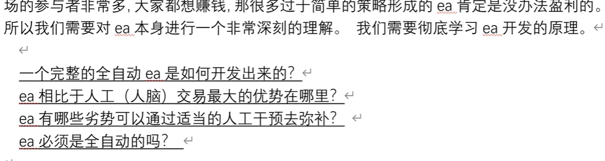

# 前言

## 介绍

## mt4 和 mt5 编程区别

指标开发
交易函数

## EA是什么

EA ： expert advisor

帮你跟踪价格，识别进场信号，识别K线形态，识别指标数据，进场开单，仓位管理，平仓管理等等

## 变量数据类型和变量的定义

日期变量：datetime   D'2019.09.17 13:23:00'  (开单时间控制，EA运行时间控制，甚至是一根K线中只开一单的控制)

字符串变量：
标识符：string  "abcd"

数组变量：
int arr[2] = {12,34}; // 定义 并 初始化

int arr[]; //  动态数组，没定义大小和值， 需要绑定相关的函数来使用，比如：根据K线的根数 去给数组分配元素个数