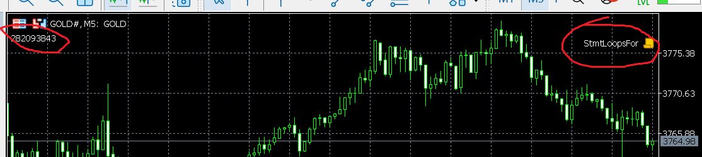
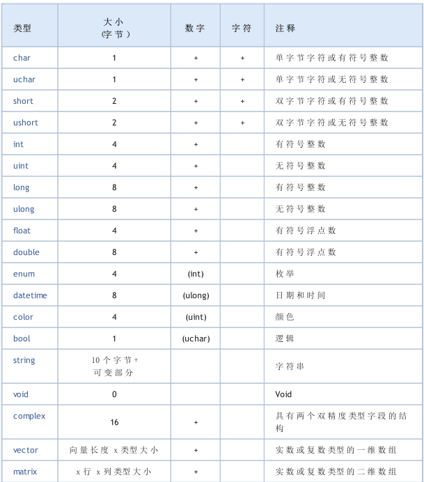

# 《面向交易员的编程指南》

## 第一章
### 1.1

mq5 : 源文件
mqh : 头文件
ex5： 编译可执行文件#

### 1.2

这本书的示例程序：放在MQL5Book子目录下面
MQL5\Scripts\MQL5Book\p1\Hello.mq5


第一章总结

1. scripts为例，最重要的是知道.mq5 怎么编译，debug， 关键是怎么执行  
2. 输入和输出
- 三种数据输出方式：Print Comment  Alert
- input 


Comment 输入

```commandline
   for( ; /*!IsStopped()*/; )  // 什么时候终止程序？右键点击黄色小标，移除
   {
      Comment(GetTickCount());  // 左上角打印tickcount  
      Sleep(1000);

      // exit upon user request to remove the script
      // 'Abnormal termination' after 3 seconds of graceful timeout
   }
```



## 第二章



mql5 支持的数据类型：datetime  color string complex vector matrix


input 变量： 

```
input group  "group_name"
input type identifier = value;   //  这个group的作用，文档没有说明白？
```


typedef  只定义函数指针mql5中
typedef double (*fun)(double, double)


